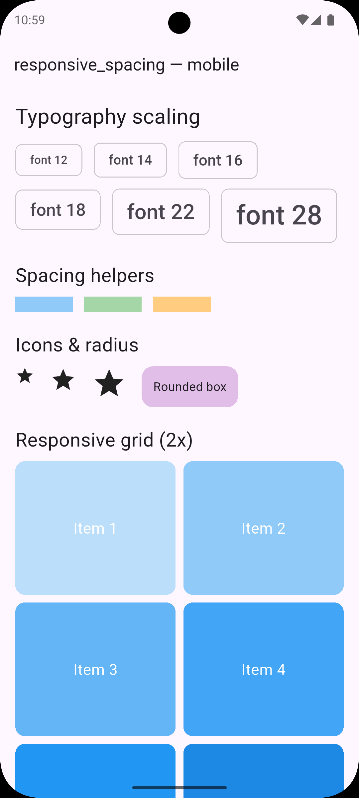
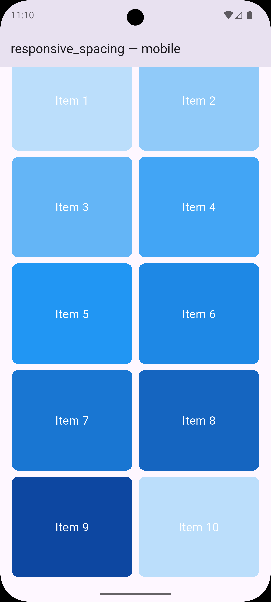
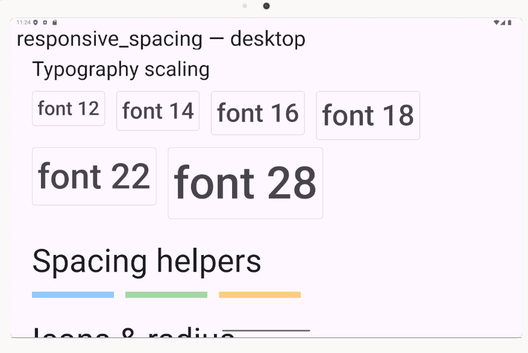
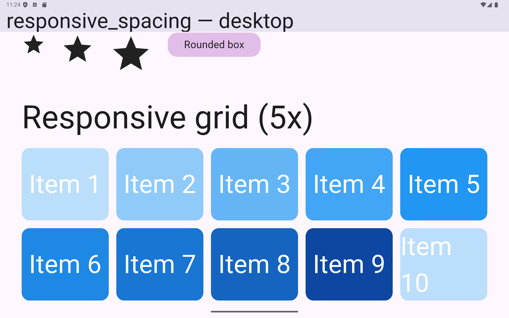

## responsive_spacing_plus

<div align="center">

<!-- Hero screenshots (top of the page) -->

| | |
|---|---|
|  |  |
|  |  |

<br/>

[GitHub repository](https://github.com/prog-hussain5/responsive_spacing_plus)

</div>

Lightweight responsive toolkit for Flutter (mobile, tablet, desktop). It provides device-type detection, screen metrics, and convenient scaling helpers for typography, spacing, icons/images, padding, and radius. It also includes design-size extensions (.w, .h, .sp, .r), a value picker per device type, and a simple builder widget.

### Features

- Device classification via width breakpoints (Mobile / Tablet / Desktop)
- Screen metrics: width, height, status bar height, AppBar height, diagonal
- Scaled sizes for: font, spacing, icons/images, padding, radius
- Design-size helpers: `.w .h .sp .r`
- `ResponsiveBuilder` widget and `ResponsiveValue<T>` for per-device choices
- Configurable design size, breakpoints, and max text scale factor

## Getting started

1) Add dependency in `pubspec.yaml`:

```yaml
dependencies:
  flutter:
    sdk: flutter
  responsive_spacing_plus: ^0.0.1
```

2) Import:

```dart
import 'package:responsive_spacing_plus/responsive_spacing_plus.dart';
```

3) (Optional) Initialize global config once if you want to override defaults:

```dart
void main() {
	Responsive.init(
		config: const ResponsiveConfig(
			designWidth: 375,
			designHeight: 812,
			maxTextScaleFactor: 2.0,
			breakpoints: ResponsiveBreakpoints(mobileMax: 600, tabletMax: 1024),
		),
	);
	runApp(const MyApp());
}
```

## Usage

### Font, spacing, and icons

```dart
Text(
	'Hello',
	style: TextStyle(fontSize: context.font(16)), // ~16 on 375px width, scales up
)

SizedBox(height: context.space(12));

Icon(Icons.star, size: context.iconSize(20));
```

### Padding and radius

```dart
Container(
	padding: context.pad(const EdgeInsets.symmetric(horizontal: 16, vertical: 12)),
	decoration: BoxDecoration(
		color: Colors.blue,
		borderRadius: BorderRadius.circular(context.radius(12)),
	),
)
```

### Design units to logical pixels

```dart
// With 375x812 as the reference design:
SizedBox(width: 100.w(context), height: 44.h(context));
Text('Title', style: TextStyle(fontSize: 14.sp(context)));
```

### Pick a value based on device type

```dart
final crossAxisCount = ResponsiveValue<int>(
	mobile: 2,
	tablet: 3,
	desktop: 5,
	fallback: 2,
).resolve(context);
```

### ResponsiveBuilder

```dart
ResponsiveBuilder(
	builder: (context, constraints, device) {
		if (device == DeviceType.desktop) {
			return const DesktopLayout();
		} else if (device == DeviceType.tablet) {
			return const TabletLayout();
		}
		return const MobileLayout();
	},
)
```

### Optional: Suggest a textScaleFactor globally

```dart
MaterialApp(
	builder: (context, child) {
		final tsf = Responsive.textScaleFactor(context);
		return MediaQuery(
			data: MediaQuery.of(context).copyWith(textScaler: TextScaler.linear(tsf)),
			child: child ?? const SizedBox.shrink(),
		);
	},
	home: ...,
)
```

## Screenshots

Captured from the `example/` app and stored under `images/` in this package:

```
images/
	mobile_font.png
	mobile_grid.png
	tablet_grid.png
	taplet_font.png
```

Embedded below (relative paths work on pub.dev):


How to capture on Windows while the example is running:

```powershell
# Run the example on Chrome (easy to resize) or on an emulator
cd example
flutter run -d chrome   # or: flutter run -d emulator-5554

# Take screenshots (OS tool)
# Press Win+Shift+S and select the app area, then save to images/*.png

# Or via Flutter (requires a connected device/emulator):
flutter screenshot --out=../images/overview.png
```

## Try the package locally and take screenshots

This repository includes an `example/` Flutter app demonstrating the API.

Run the example (Windows PowerShell):

```powershell
cd example
flutter pub get
# Pick one of your available devices (Chrome/emulator/Windows app):
flutter devices
flutter run -d chrome
# or: flutter run -d windows
# or: flutter run -d <emulator-id>
```

Take screenshots:
- Use your OS tools (Windows: Snipping Tool / Win+Shift+S) while the app is running.
- Or use Flutter CLI with a connected device:

```powershell
flutter screenshot --out=screen1.png
```

Tips:
- Resize the app window (on desktop) or test various devices (on Chrome/emulators) to capture different layouts.
- Ensure you capture examples of typography scaling, spacing, and grid changes.

## Publishing to pub.dev (brief)

1) Ensure `LICENSE`, `README.md`, and `CHANGELOG.md` exist and are up to date.
2) Update `pubspec.yaml` with proper `name`, `description`, `version` and optionally `homepage`/`repository`.
3) Dry run:

```powershell
flutter pub publish --dry-run
```

4) Publish:

```powershell
flutter pub publish
```

Follow semantic versioning for subsequent releases and keep the changelog updated.

## Contributing

Issues and PRs are welcome.
